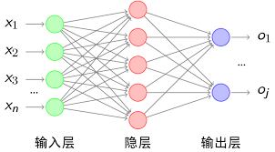

## 全连接层的反向传播
下面介绍一下全连接层的反向传播算法的推导。首先对全连接层的前向过程进行一下介绍。



我们把全连接层的每一层神经元都表示为一个列向量。上一层的神经元的输出，通过乘上当前层的权重矩阵加上列向量形式的偏置项，得到激活前的输出值，最后通过激活函数得到当前层的输出，公式如下：
$$z^l=W^la^{l-1}+b^l$$
$$a^l=\sigma (z^l)$$
其中 $z^l$表示第$l$层未经过激活函数的结果，$a^l$表示经过激活函数得到的输出结果。假设上一层的输出是[m,1]的列向量，当前层的输出是[n,1]的列向量，那权重矩阵应为[n,m],偏置矩阵为[n,1]。
接下来进行反向传播的过程，首先定义一个误差函数，来衡量神经网络与正确的输出之间的差异。为了简单，本文直接采用了最简单的均方误差损失函数：
$$C=\frac{1}{2}||a^L-y||^2$$ 
其中$L$代表多层感知机的总层数，得到总误差之后，我们就可以通过反向传播对各层的权重矩阵$W^l$和偏置列向量$b^l$进行更新，使神经网络的误差减小，达到训练的目的。  
由于反向传播链式传导的规律，为了避免重复计算，我们引入中间量$\delta^l$,我们称它为第$l$层的误差，具体含义为误差函数对于神经网络第$l$层未经激活函数的输出值的偏导数，即$\delta^l=\frac{\partial C}{\partial z^l}$，输出层的网络误差$\delta ^L$ 为：
$$\delta ^L=\frac{\partial C}{\partial z^L}=\frac{\partial C}{\partial a^L}\frac{\partial a^L}{\partial z^L}=(a^L-y)\bigodot \sigma^l(z^l)$$
其中，$\bigodot$表示矩阵逐元素相乘。  
接下来求$W$矩阵的导数，应用链式法则，得：
$$\frac{\partial C}{\partial W^l}=\frac{\partial C}{\partial z^l}\frac{\partial z^l}{\partial W^l}=\delta^L(a^{L-1})^T$$
$$\frac{\partial C}{\partial b^l}=\frac{\partial C}{\partial z^l}\frac{\partial z^l}{\partial b^l}=\delta^L\bigodot1=\delta^L$$
矩阵乘法的求导即乘上系数矩阵所对应的转置，同时左乘还是右乘需要跟上述前向过程保持一致。
我们得到了最后一层的误差，接下来我们根据后一层的 $\delta$ 得到前一层的$\delta$，最后我们可以求得每一层的$\delta$。假设我们得到了第 $l+1$ 的 $\delta$ ，第$l$层的 $\delta$ 表示如下：
$$\delta^l=\frac{\partial C}{\partial z^l}=\frac{\partial C}{\partial z^{l+1}}\frac{\partial z^{l+1}}{\partial z^l}=\delta^{l+1}\frac{\partial z^{l+1}}{\partial z^l}$$ 
$$z^{l+1}=W^{l+1}a^l+b^{l+1}=W^{l+1}\delta(z^l)+b^{l+1}$$
$$\delta^l=(W^{l+1})^T\delta^{l+1}\bigodot\delta'(z^l)$$
这同时也要注意求导后矩阵运算是左乘还是右乘。
接下来我们分析误差函数$C$对每一层参数$W$的梯度
$$\frac{\partial C}{\partial w^l}=\frac{\partial C}{\partial z^l}\frac{\partial z^l}{\partial w^l}=\delta^l(a^{l-1})^T$$
$$\frac{\partial C}{\partial b^l}=\frac{\partial C}{\partial z^l}\frac{\partial z^l}{\partial b^l}=\delta^l$$
接下来通过梯度下降法更新权重和偏置
$$W^l=W^l-\eta\frac{\partial C}{\partial w^l}$$
$$b^l=b^l-\eta\frac{\partial C}{\partial b^l}$$
在上述的分析中，我们只根据一组训练数据更新权重，在一般情况下，我们往往会采用随即梯度下降法，一次性训练一批数据，先计算一批数据的中每一组数据的误差，在根据它们的平均值来进行权重更新
$$W^l=W^l-\frac{\eta}{batch_size}\sum{\frac{\partial C}{\partial W^l}}$$

```python
def full_connect(self,input_data,fc,front_delta=None,deriv=False):
    N=input_data.shape[0]
    if deriv==False:
        output_data=np.dot(input_data.reshape(N,-1),fc)
        return output_data
    else:
        back_delta=np.dot(front_delta,fc.T).reshape(input_data.shape)
        fc+=self.lr*np.dot(input_data.reshape(N,-1),front_delta)
        return back_delta,fc
```